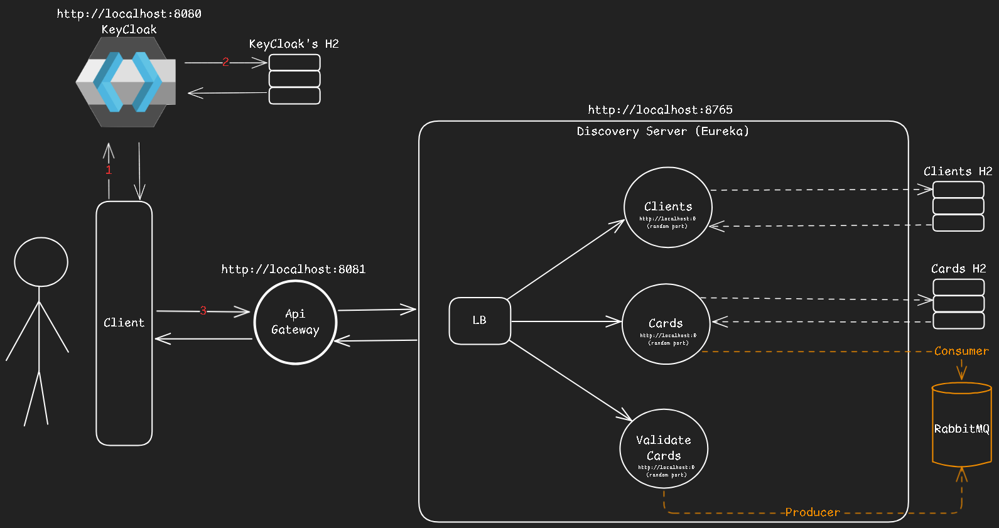

# Fake Fintech Microservice

> A small fintech microservices demo: Keycloak, Eureka, RabbitMQ, API Gateway, and a few Spring services wired to simulate card issuance and client credit validation.

[](#)
[](#)

---

## Overview

This repository contains a toy, but realistic, fintech microservice ecosystem meant for learning and experimentation. It demonstrates:

- service discovery with **Eureka**
- API gateway routing
- authentication with **Keycloak**
- asynchronous communication with **RabbitMQ**
- inter-service communication with **Spring Cloud OpenFeign**
- dockerized local development using **Docker Compose**

The goal is to be a practical playground for concepts like service-to-service calls, token-based security, message-based integration, and simple domain logic: clients, cards and credit validation.

---

## System Design



---

## Tech stack

- Java 21
- Maven
- Spring Boot v3.5.7
- Spring Cloud v2025.0.0
- Spring Cloud OpenFeign
- Eureka Server
- Keycloak
- RabbitMQ v3.10.management
- Lombok
- Docker & Docker Compose

---

## Services & API (quick reference)

All services expose endpoints under `/api/v1` and are routed through the API Gateway (default port `8080`). When running locally, start the docker first, then Eureka, then Gateway, then the other services (Be aware that if you start the gateway first, it will need some time to communicate with the other services, so wait for a few seconds before using the application).

### Client Service

- **GET** `/api/v1/clients`

  - Returns: `200 OK` — simple health/list placeholder

- **POST** `/api/v1/clients`

  - Request body:

    ```json
    {
      "name": "string",
      "age": 30,
      "cpf": "000.000.000-00"
    }
    ```

  - Response: `201 Created`
  - Location header example: `http://localhost:{port}/api/v1/clients?cpf={cpf}`

- **GET** `/api/v1/clients?cpf={cpf}`

  - Response body:

    ```json
    {
      "id": 1,
      "name": "string",
      "age": 30,
      "cpf": "000.000.000-00"
    }
    ```

---

### Cards Service

- **GET** `/api/v1/cards`

  - Returns: `200 OK` — health or list placeholder

- **POST** `/api/v1/cards`

  - Request body:

    ```json
    {
      "name": "Gold Card",
      "brand": "VISA", // allowed: MASTERCARD | VISA | DISCOVER | AMERICAN_EXPRESS
      "income": 5000.0,
      "limit": 1200.0
    }
    ```

  - Response: `201 Created`

- **GET** `/api/v1/cards?income={income}`

  - Returns a list of cards suitable for the provided income (cards where `card.income <= income`).

- **GET** `/api/v1/cards?cpf={cpf}`

  - Returns cards associated with a client (name, brand, limit)

---

### Credit Validator Service

- **GET** `/api/v1/credit-validate`

  - Returns: `200 OK` — health or placeholder

- **GET** `/api/v1/credit-validate?cpf={cpf}`

  - Returns client summary and card recommendations:

    ```json
    {
      "client": {
        "id": 1,
        "name": "Jane Doe"
      },
      "cards": [
        {
          "id": 1,
          "name": "Gold Card",
          "brand": "VISA",
          "approvedLimit": 1000.0
        }
      ]
    }
    ```

- **POST** `/api/v1/credit-validate` (validate for new card)

  - Request body:

    ```json
    {
      "cpf": "000.000.000-00",
      "income": 4000.0
    }
    ```

  - Response: list of recommended cards with approved limits

- **POST** `/api/v1/credit-validate/register` (register a card to a client)

  - Request body:

    ```json
    {
      "cardId": 10,
      "cpf": "000.000.000-00",
      "address": "Street, City, Country",
      "approvedLimit": 1500.0
    }
    ```

  - Response example:

    ```json
    {
      "protocol": "2025-10-26-ABC123"
    }
    ```

  - Produces an asynchronous event to RabbitMQ and returns a registration protocol/receipt.

---

### RabbitMQ

- A queue named `card-issuance-requests` is used to handle card issuance requests asynchronously.

- The Exchanege used is `card-issuance-exchange` of type `direct` or `topic`, depending on the routing needs.

---

### Keycloak

- Secures endpoints using OAuth2 / OpenID Connect.
- Default realm: `fintech-realm`
- Default client: `fintech-client`
- Users can be created in Keycloak for testing secured endpoints.

port: `8081`

---

## Example `curl` requests

Register a client:

```bash
curl -X POST http://localhost:8080/api/v1/clients \
  -H "Content-Type: application/json" \
  -d '{"name":"Jane Doe","age":34,"cpf":"000.000.000-00"}'
```

Validate credit:

```bash
curl -X POST http://localhost:8080/api/v1/credit-validate \
  -H "Content-Type: application/json" \
  -d '{"cpf":"000.000.000-00","income":4000.00}'
```

Register card to client:

```bash
curl -X POST http://localhost:8080/api/v1/credit-validate/register \
  -H "Content-Type: application/json" \
  -d '{"cardId":10,"cpf":"000.000.000-00","address":"Av. Example, 123"}'
```

---

## Prerequisites & Local setup

1. Install Docker & Docker Compose
2. Optionally, you can Install Java 21 and Maven if you want to run services locally without containers

### Running with Docker Compose

- `docker compose up --build`

### Running services locally

1. Start **Eureka** (run server module)
2. Start **Gateway** (it depends on Eureka)
3. Start remaining services (Client, Cards, Credit Validator)
4. Start **Keycloak** and configure realm + clients if you want to test secured endpoints
5. Start **RabbitMQ**

---

## Environment variables (example)

- `EUREKA_SERVER_URL` — e.g. `http://localhost:8761/eureka`
- `SPRING_PROFILES_ACTIVE` — dev, docker, etc.
- `KEYCLOAK_URL` — base URL for Keycloak
- `RABBITMQ_HOST`, `RABBITMQ_PORT`, `RABBITMQ_USER`, `RABBITMQ_PASS`

---

## License

MIT — see `LICENSE` file.
