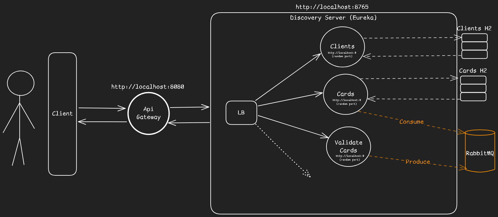

# Fake-Fintech-Microservice

Using Keycloak, RabbitMQ, Eureka Server, and a few other technologies, I plan to build a fully functional FINTECH application! I hope you like what you see!

## System Design



## Technologies

    - Java 21
    - Spring Boot 3.5.7
    - Swagger
    - Eureka Server
    - RabbitMQ
    - Api Gateway
    - Load Balancer (eureka server LB...)

# Services

## Api Gateway

Gateway is running on the 8080 port, it's redirecting everything to the Eureka's LB, so if you want to communicate with the system... first run the eureka server and then run the gateway AND THEN you can test the application.

---

## Client Service

- GET - `api/v1/clients`
  - **Output:**
    `ok`

---

- Register a new client - `api/v1/clients`

  - **Request Body:**

    ```json
    {
      "name": "string",
      "age": "int",
      "cpf": "string" // the cpf field is the Brazilian ID..
    }
    ```

  - **Output:**
    `http://localhost:{port}/api/v1/clients?cpf={cpf}`

---

- List a client by his cpf - `api/v1/clients?cpf={...}`

  - **Output:**

    ```json
    {
      "id": "long",
      "name": "string",
      "age": "int",
      "cpf": "string"
    }
    ```

## Cards Service

- GET - `api/v1/cards`
  - **Output:**
    `ok`

---

- Register a new card to a client - `api/v1/cards`

  - **Request Body:**

    ```json
    {
      "name": "string",
      "brand": "string", //Can only be: mastercard, visa, discover or american express
      "income": "decimal",
      "limit": "decimal"
    }
    ```

  - **Output:**
    `HttpStatus 201 - Created`

---

- List all the cards available that their income is less or equal to the "income" param - `api/v1/cards?income={...}`

  - **Output:**

    ```json
    [
      {
        "id": "long",
        "name": "string",
        "brand": "string",
        "income": "long",
        "limit": "decimal"
      }
    ]
    ```

---

- List all the cards from a client by the client Cpf - `api/v1/cards?cpf={...}`

  - **Output:**

    ```json
    [
      {
        "name": "string",
        "brand": "string",
        "limit": "decimal"
      }
    ]
    ```

## Credit Validator Service

- GET - `api/v1/credit-validate`
  - **Output:**
    `ok`

---

- Checks the client status by their cpf - `api/v1/credit-validate?cpf={...}`

  - **Output:**

    ```json
    {
      "client": {
        "id": "long",
        "name": "string",
        "age": "int",
        "cpf": "string"
      },
      "cards": [
        {
          "id": "long",
          "name": "string",
          "brand": "string",
          "limit": "decimal"
        }
      ]
    }
    ```

---

- Validate to see if a client is available to a new card or cards - `api/v1/credit-validate`

  - **Request Body:**

    ```json
    {
      "cpf": "string",
      "income": "decimal"
    }
    ```

  - **Output:**

    ```json
    [
      {
        "name": "string",
        "brand": "string",
        "approvedLimit": "decimal"
      }
    ]
    ```

---

- Register a card to a client - `api/v1/credit-validate`

  - **Request Body:**

    ```json
    {
      "cardId": "long",
      "cpf": "string",
      "address": "string"
    }
    ```

  - **Output:**

    ```json
    [
      {
        "protocol": "string"
      }
    ]
    ```
